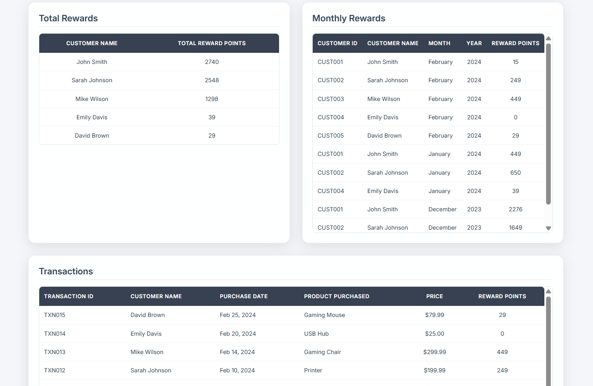
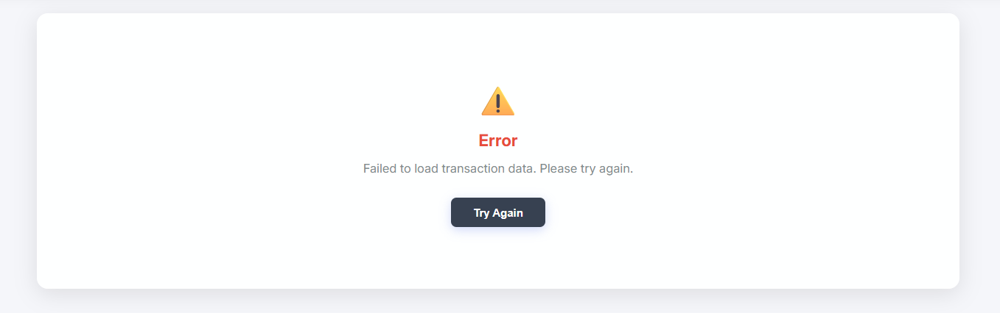
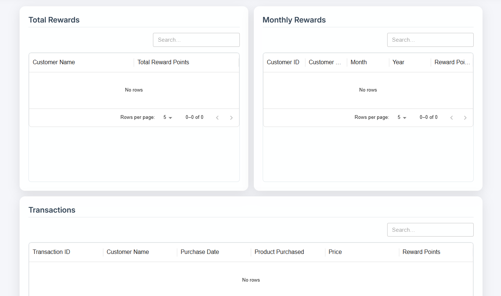

# Customer Rewards Program

## 📖 Project Explanation

The **Customer Rewards Program** is a React + Vite application that tracks customer transactions and calculates reward points based on configurable business rules. The app demonstrates modern React development practices, including component-based architecture, state management, error handling, and responsive design.

**Reward Calculation Rules:**
- **2 points** for every dollar spent over $100
- **1 point** for every dollar spent between $50 and $100
- **0 points** for purchases under $50

**Example:**  
A $120 purchase = 2×$20 + 1×$50 = **90 points**

The application displays:
- **Total rewards per customer**
- **Monthly rewards per customer**
- **Detailed transaction history**

It also handles loading and error states gracefully, providing a robust user experience.

---

## 📁 Folder Structure

```
src/
  components/
    ErrorBoundary.jsx         # Catches and displays UI errors
    ErrorMessage.jsx          # Shows error messages with retry
    LoadingSpinner.jsx        # Animated loading indicator
    MonthlyRewardsTable.jsx   # Table for monthly rewards per customer
    TotalRewardsTable.jsx     # Table for total rewards per customer
    TransactionsTable.jsx     # Table for all transactions
  utils/
    rewardsCalculator.js      # Pure functions for reward calculations
    dataProcessing.js         # Data grouping and transformation utilities
    logger.js                 # Centralized logging utility
  data/
    mockData.js               # Mock transaction data
  App.jsx                     # Main application component
  App.css                     # Global styles
  main.jsx                    # React entry point
```

---

## 🖼️ Screenshots


### 1. Main Dashboard (All Data Loaded)

- Shows all three tables: Total Rewards, Monthly Rewards, Transactions.

### 2. Error State

- Shows error message and retry button when data fetch fails.

### 3. Empty State

- Shows “No data available” message when there are no transactions.

---

## ℹ️ How to Run

1. **Clone the repository**
   ```bash
   git clone <repository-url>
   cd customer-reward-points
   ```
2. **Install dependencies**
   ```bash
   npm install
   ```
3. **Start the development server**
   ```bash
   npm start
   ```
4. **Open in your browser**
   Go to [http://localhost:5173](http://localhost:5173)

---

- **Tech Stack:** React 19, Vite 7, CSS3


