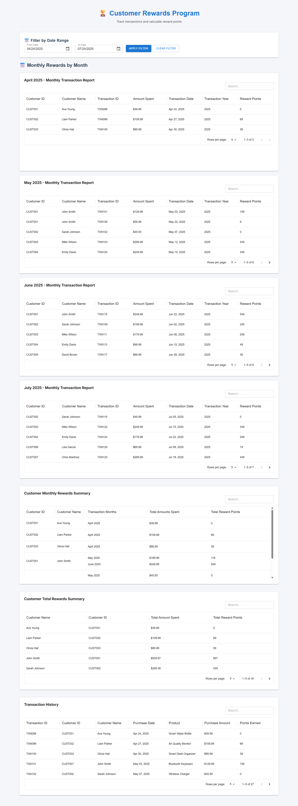
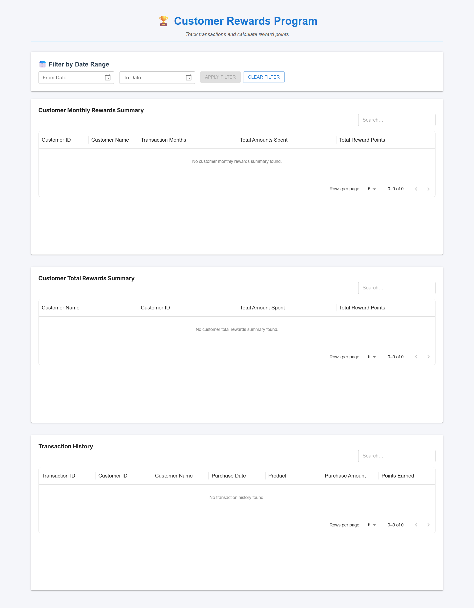
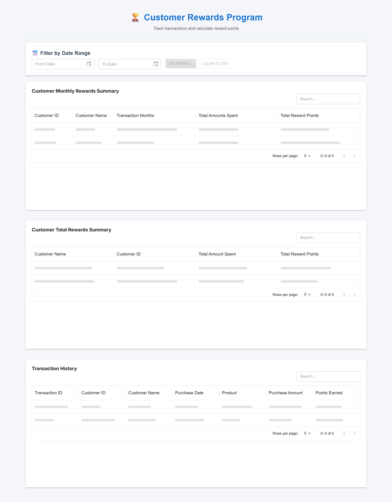

# Customer Rewards Program

## 📖 Project Explanation

The **Customer Rewards Program** is a React application that tracks customer transactions and calculates reward points based on configurable business rules. The app demonstrates modern React development practices, including component-based architecture, state management, error handling, and responsive design.

**Reward Calculation Rules:**
- **2 points** for every dollar spent over $100
- **1 point** for every dollar spent between $50 and $100
- **0 points** for purchases under $50

**Example:**  
A $120 purchase = 2×$20 + 1×$50 = **90 points**

## 🎯 Key Features

- **📅 Date Range Filtering** - Filter transactions by custom date ranges
- **📊 Multiple Data Views** - Total rewards, monthly breakdown, and detailed transactions
- **💰 Total Amount Tracking** - Track total spending alongside reward points
- **📱 Responsive Design** - Works on desktop and mobile devices
- **⚡ Real-time Validation** - Instant feedback on date selections
- **🔄 Error Handling** - Graceful error states with retry functionality
- **🔍 Search & Filter** - Built-in search across all data tables

The application displays:
- **Customer Total Rewards Summary** - Overall rewards and spending per customer
- **Customer Monthly Rewards Summary** - Month-wise breakdown with consolidated view
- **Monthly Transaction Reports** - Detailed transaction-level data by month
- **Transaction History** - Complete transaction details with filtering

### 📅 **Default Date Range**
- **Automatically loads last 3 months** of data on startup
- **Reset returns to 3-month default** for consistent user experience
- **Immediate value** - users see relevant data without manual filter setup

---

## 📁 Folder Structure

```
public/
  mockData.json                # JSON dataset for transactions
src/
  components/
    Dashboard.js               # Main dashboard layout and state management
    DateRangeFilter.js         # Date range filtering component (was GlobalFilter)
    ErrorBoundary.js           # Catches and displays UI errors
    ErrorMessage.js            # Shows error messages with retry
    MonthlyRewardsByMonth.js   # Separate monthly transaction detail tables
    MonthlyRewardsTable.js     # Consolidated monthly rewards summary
    TotalRewardsTable.js       # Customer total rewards and spending
    TransactionsTable.js       # All transactions with search functionality
    ReusableTable.js           # Shared table component with search/pagination
  utils/
    rewardsCalculator.js       # Pure functions for reward calculations
    dataProcessing.js          # Data grouping, filtering, and transformation
    formatters.js              # Date and Currency formatting
    logger.js                  # Centralized logging utility
    __tests__/
      rewardsCalculator.test.js # Unit tests for rewards logic
      dataProcessing.test.js    # Unit tests for data processing & filtering
  data/
    mockData.js               # Mock transaction data fetcher with error simulation
  screenshots/
    main-dashboard.png        # Screenshot: main dashboard
    date-filter.png           # Screenshot: date filter interface
    error-state.png           # Screenshot: error state
    empty-state.png           # Screenshot: empty state
    loading-state.png         # Screenshot: loading state
  App.js                      # Main application component with error boundary
  App.css                     # Global styles
  index.js                    # React entry point
  logo.svg                    # App logo
  setupTests.js               # Test setup file
  reportWebVitals.js          # Web vitals reporting
```
---

## 🖼️ Screenshots

### 1. Main Dashboard (Filtered Data Loaded)

- Shows all sections populated after applying date filter

### 2. Date Range Filter Interface

- Professional date range selection with validation
- Clean, intuitive filtering interface

### 3. Error State

- Error message with retry functionality

### 4. Empty State

- Clean empty state before filter is applied

### 5. Loading State

- Loading indicators during data fetch

---

## ℹ️ How to Run

1. **Clone the repository**
   ```bash
   git clone <repository-url>
   cd customer-reward-points
   ```
2. **Install dependencies**
   ```bash
   npm install
   ```
3. **Start the development server**
   ```bash
   npm start
   ```
4. **Open in your browser**
   Go to [http://localhost:3000](http://localhost:3000)

5. **Run tests**
   ```bash
   npm test
   ```

---

## 🧪 Testing

The application includes comprehensive unit tests for:
- **Reward calculation logic** - All business rules and edge cases
- **Data processing functions** - Grouping, filtering, and transformations
- **Date range filtering** - Various date scenarios and edge cases
- **Error handling** - Invalid inputs and missing data

Run tests with: `npm test`

---

## 🛠️ Tech Stack

- **React 19** (with Create React App)
- **Material-UI (MUI) v5** - UI components and DataGrid
- **MUI X Date Pickers** - Professional date selection
- **Day.js** - Date manipulation and formatting
- **CSS3** - Custom styles and responsive design
- **Jest & React Testing Library** - Unit testing
- **JSON** - Mock data simulation

---